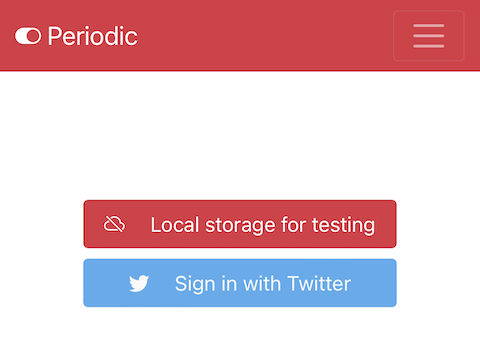

# periodic

This is a reminder to manage your daily tasks.

## demo

[https://periodic.druby.work/app/](https://periodic.druby.work/app/ "Periodic")

## for users

上部のアイコンはタグによるフィルタだよ。

左上はタスクを全て表示するよ！困ったらここを押す。


### Edit

編集はこんな感じ。タスクに複数のタグがつけられるよ。


### Login

めんどくさいけど、ログインがあるよ。
Local storageはテスト用でブラウザにデータを保存するよ。（通信はするよ）

Twitter連携はユーザーを識別するためだけに使うよ。サーバーサイドに保存するときにその情報を使います。
そうそう、データは平文でテキストファイルに保存されるので注意です。（管理者（というかseki）が見られないようにする仕組みがありません）



#### Local storage for testing
save the data in your browser, for testing.

#### Sign in with Twitter
save the data on the server. twitter integration is used to identify users.


## for me
### setup

```
export TW_CONSUMER_KEY=...
export TW_CONSUMER_SECRET=...
export TW_CALLBACK=...

ruby main.rb
```